  

## 📌 About Me
- Aspiring Data Scientist with hands-on experience in data modeling and entity design from a Data Engineer internship at the Provincial Government of Bataan.
- Currently focused on strengthening my foundation in Data Science by building projects involving prediction, recommendation, classification, and clustering. Passionate about turning data into actionable insights and delivering real business value.
- Actively seeking opportunities to apply my skills, contribute to impactful projects, and grow as a data professional.

## 🧠 My Focus Areas
- ETL/ELT Pipelines – Building efficient data workflows for ingestion, transformation, and storage
- Machine Learning – Developing models for prediction, recommendation, classification, and clustering
- Data Analysis – Extracting insights and supporting data-driven decision-making

## 📊 GitHub Stats & Trophies

  
  

  

  

  

## 🛠️ Languages & Tools

> ## Programming Languages

> ## Database

  

> ## Tools

 

  

## 🔗 Connect with Me

  

  

